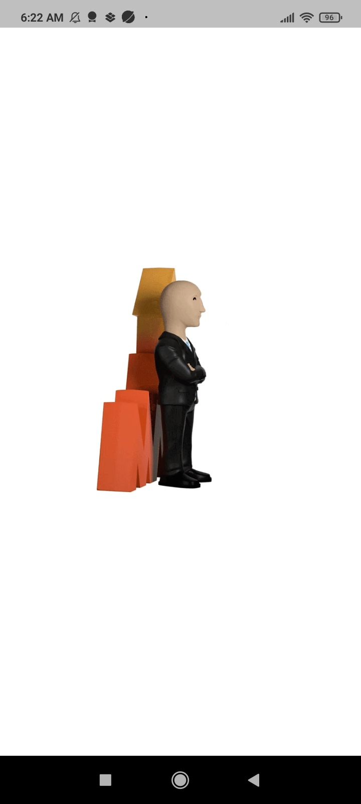
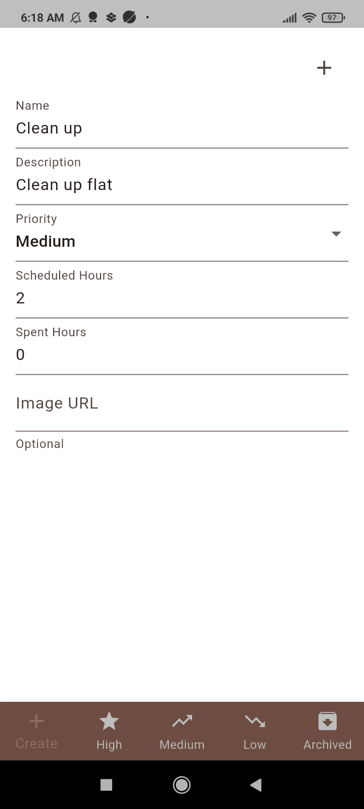
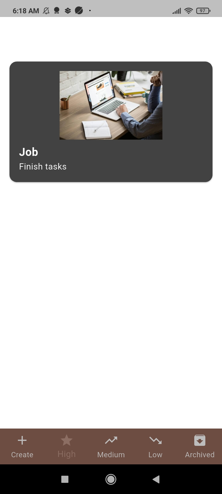
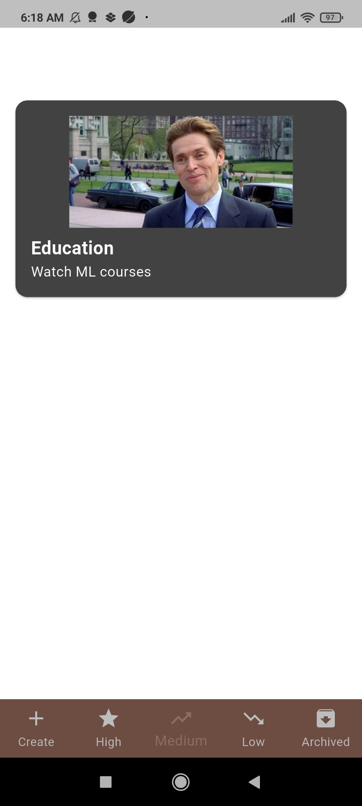
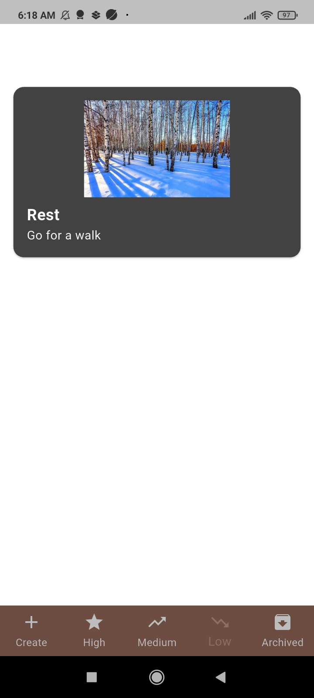
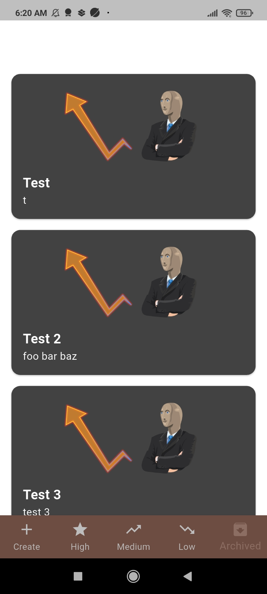

# Successful Success

Mobile Android/IOS time management App

## Screenshots

<table>
	<tr>
		<td></td>
		<td></td>
		<td></td>
	</tr>
	<tr>
		<td></td>
		<td></td>
		<td></td>
	</tr>
</table>

## Manual Tests videos

## Architecture and Design

The app follows a layered Flutter structure with feature separation under the `lib` directory.

Architecture overview:

- **Presentation layer**: screens and widgets in `lib/ui`
- **State management layer**: BLoC logic in `lib/bloc` for predictable event/state flow
- **Domain/data layer**: models in `lib/models` 
- **Infrastructure layer**: services in `lib/services`
- **Design system**: shared tokens and constants in `lib/app_design` (colors, dimensions, durations, layout)

Design principles:

- Consistent visual style via centralized design constants
- Maintainable modular code with clear folder boundaries
- Cross-platform support for Android and iOS from a single Flutter codebase

